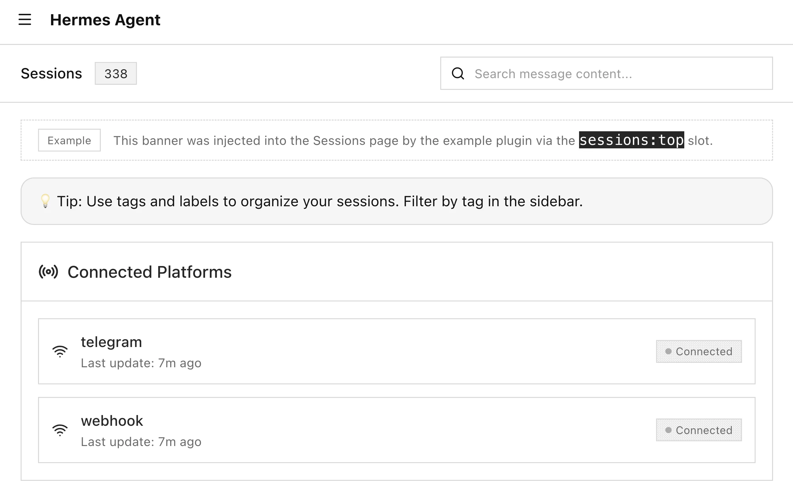
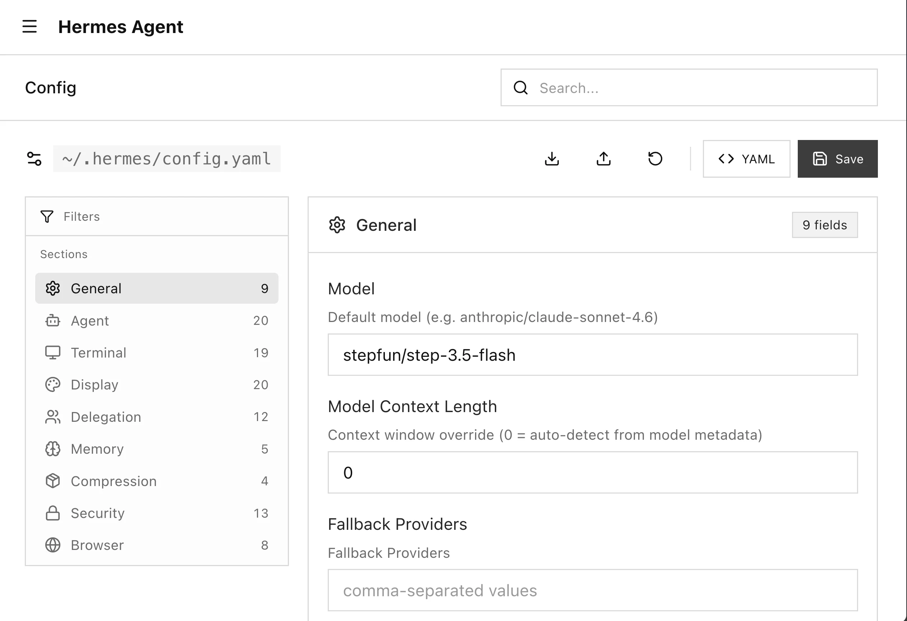
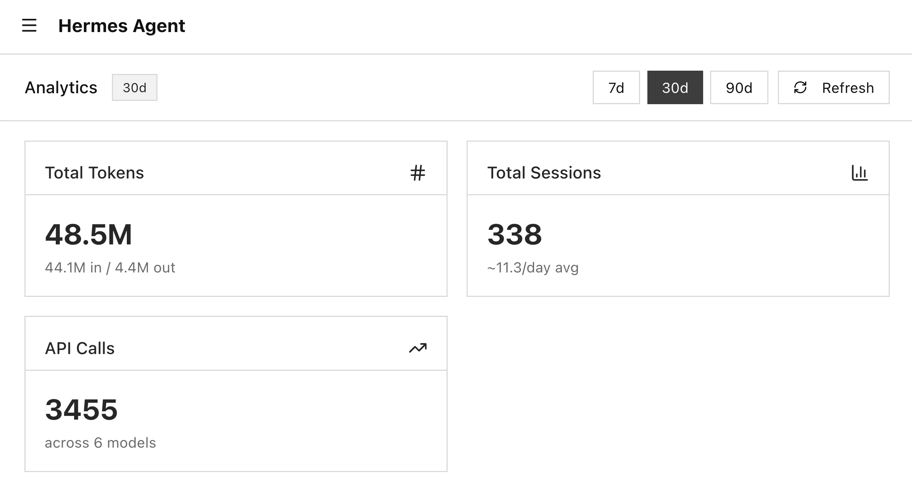

[English](README.md) · [简体中文](README.zh-CN.md)

# Hermes Dashboard Theme: Porcelain（白瓷主题）


Porcelain（白瓷）是为 Hermes Agent 仪表板设计的极简、高可读性浅色主题。
它保持默认的仪表板布局、尺寸和控件不变，同时用素雅的灰度表面、系统字体
和高对比度控件取代了原本风格化的深色处理和装饰性光晕。

## 设计目标

- 保留 Hermes 仪表板的默认布局、尺寸和控件位置
- 使用原生系统字体，而非默认的风格化展示字体
- 保持灰度配色，在白底上保持高可读性
- 移除装饰性光晕、纹理和填充图像，避免浅色模式下分散注意力
- 保持仅图标控件、开关、徽章和小标签的可见性

## 截图

| Sessions | Config | Analytics |
|---|---|---|
|  |  |  |

## 项目结构

```text
hermes-dashboard-theme-porcelain/
├── theme/
│   └── porcelain.yaml
├── plugin/
│   ├── manifest.json
│   ├── plugin_api.py
│   └── dist/
│       ├── index.js
│       └── style.css
├── docs/
│   └── FEATURES.md
├── scripts/
│   ├── dev.sh
│   └── install.sh
├── DESIGN.md
├── README.md
└── CONTRIBUTING.md
```

## 安装

```bash
./scripts/install.sh
```

安装脚本会将 `theme/porcelain.yaml` 复制到 `~/.hermes/dashboard-themes/`。
如果检测到旧的 `minimalist.yaml` 中声明了 `name: porcelain`，会将其重命名为
`minimalist.yaml.disabled`，确保 Hermes 优先发现新的 `porcelain.yaml` 定义。
脚本还会询问是否安装配套插件：插件本身不是主题运行所必需的，但推荐安装，
因为它在其他主题激活时也能显示 Porcelain 的色板预览，而无需修改 Hermes 核心。

手动安装：

```bash
mkdir -p ~/.hermes/dashboard-themes
if grep -Eq '^name:[[:space:]]*porcelain[[:space:]]*$' ~/.hermes/dashboard-themes/minimalist.yaml 2>/dev/null; then
  mv ~/.hermes/dashboard-themes/minimalist.yaml ~/.hermes/dashboard-themes/minimalist.yaml.disabled
fi
cp theme/porcelain.yaml ~/.hermes/dashboard-themes/

mkdir -p ~/.hermes/plugins/porcelain-theme/dashboard
cp -r plugin/. ~/.hermes/plugins/porcelain-theme/dashboard/
```

如果仪表板已在运行，安装主题后刷新浏览器即可。如果安装或更新了配套插件，
需要请求插件重扫描或重启仪表板：

```bash
curl http://127.0.0.1:9119/api/dashboard/plugins/rescan
```

## 配套插件

当前 Hermes 在激活其他主题时，为用户 YAML 主题渲染占位符色块。YAML 主题无法改变这一状态，
因为其 `customCSS` 仅在主题被选中后才注入。

配套插件就是这个问题的可共享解决方案：它不修改 Hermes 源码，也不添加 UI 面板或页面横幅。
它仅修补现有的主题选择器 DOM，使 Porcelain 行能像内置主题一样显示色块。

## 开发

```bash
./scripts/dev.sh install
./scripts/dev.sh install-plugin
./scripts/dev.sh check
./scripts/dev.sh logs
```

发布更改前运行以下检查：

```bash
ruby -e 'require "yaml"; YAML.load_file("theme/porcelain.yaml")'
node --check plugin/dist/index.js
python3 -m json.tool plugin/manifest.json >/dev/null
bash -n scripts/dev.sh scripts/install.sh
git diff --check
```

## License

MIT.
